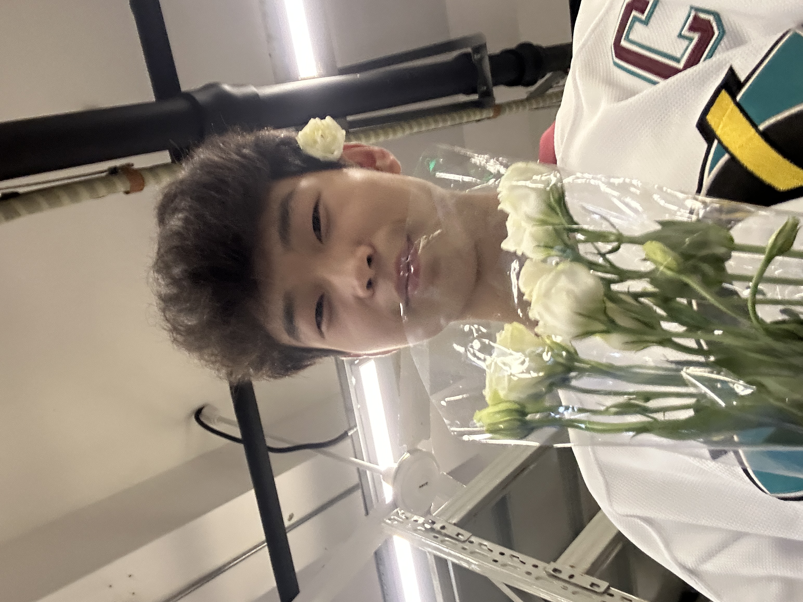

<!DOCTYPE html>
<html lang="en">
<head>
  <meta charset="UTF-8">
  <meta name="viewport" content="width=device-width, initial-scale=1.0">
  <title>Will You Be My Valentine?</title>
  
</head>
<body>
  <!-- Falling Hearts -->
  

    ❤️
    ❤️
    ❤️
    ❤️
    ❤️
    ❤️
    ❤️
    ❤️
    ❤️
  

  <audio id="background-music" autoplay loop>
    <source src="music.mp3" type="audio/mpeg">
  </audio> 
  <!-- Main Content -->
  <h1>Will You Be My Valentine?</h1>
  
Hey love, I have a very important question for you...

  <!-- Image Container -->
  

    
  

  

    <button id="yes-btn" class="valentine-btn" onclick="showResponse()">Yes</button>
    <button id="no-btn" class="valentine-btn" onclick="resizeButtons()">No</button>
  

  

    
❤️

    
Thank you for making me the happiest person! 我爱你宝贝儿 💕

  

  <!-- Flower Container -->
  

 
  
</body>
</html>
